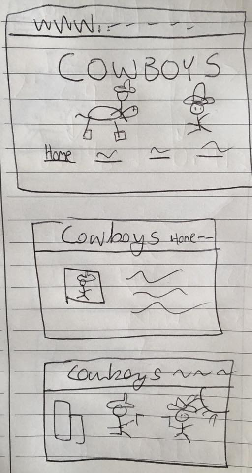
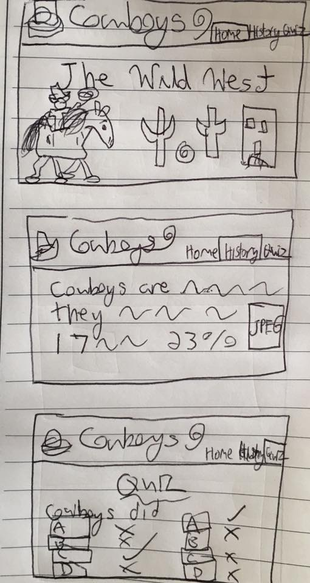

# Project 1, Milestone 1 - Design & Plan

Your Name: Hamed Rabah

## 1. Persona

I've selected Abby as my persona.

I've selected my persona because I think Abby is representative of most internet users. I wanted to design a website that would be easy for as many people as possible to access it, and by designing for Abby the other personas would also have no problem accessing the website.

## 2. Sketches

[2. Create some sketches to generate ideas about a website design that would work for your persona.]

## 3. Wireframes

## 4. Coding Plan & Pseudocode

I will use php includes for the navigation bar and footer to avoid writing out repetitive code.

Pseudocode for user defined function:

Cowboy Quiz id=question1:

user_input(A, B, C, D)

if correct:

  return "correct" and style = green

else:
  return "incorrect" and style = red

  and style(correct)= green
